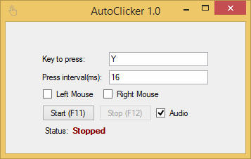

# AutoClicker

## Auto mouse button clicker with keyboard key press afterwards

AutoClicker is a software created for automated clicking and key pressing with configurable delay (in ms) between every click and press key cycle. It may auto click left and right mouse button simultaneously. Clicks are triggered by sending mouse down and then mouse up events. After clicking application may also simulate keyboard key press. AutoClicker globally listens for `F11` and `F12` key presses to comfortably and easily start and stop automated actions. Application may also play a sound when it starts as global key presses listening makes application being visible unnecessary.

## UI screenshot

